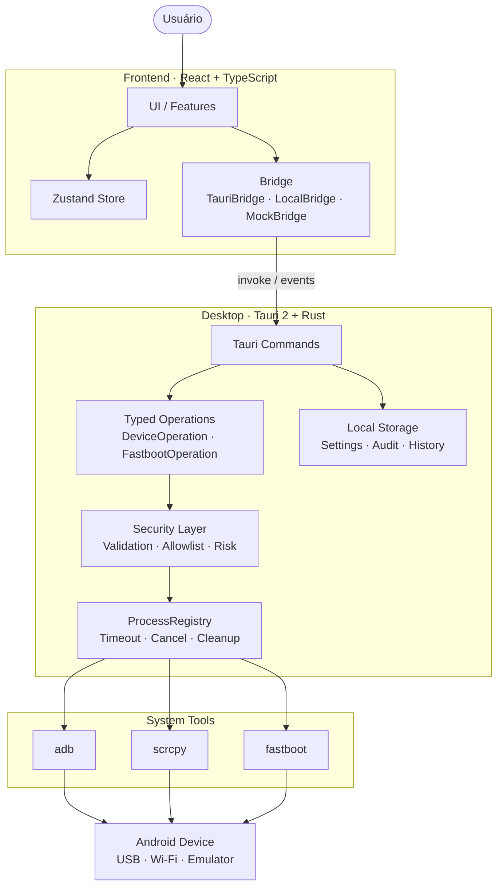
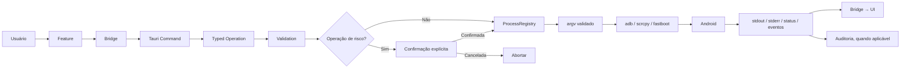
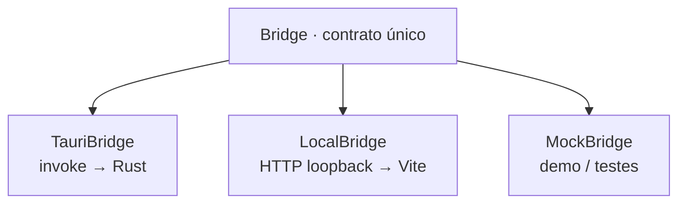
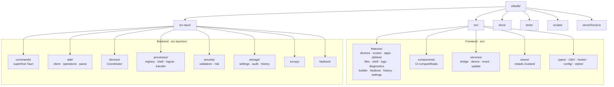
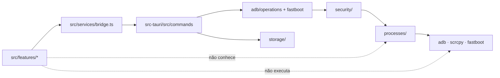

<p align="center">
  
</p>

<p align="center">
  <a href="https://github.com/theeussx/zittodb/releases"></a>
  <a href="LICENSE"></a>
  
  
  
  
</p>

<h3 align="center">Interface gráfica leve e local-first para <strong>ADB</strong>, <strong>scrcpy</strong> e <strong>fastboot</strong> no Linux.</h3>
<p align="center"><em>Android Debug Bridge, direto e local.</em></p>

<p align="center">
  Dispositivos, shell, screenshots, espelhamento de tela, aplicativos (com debloat e
  classificação de risco), arquivos, logcat, diagnóstico, auditoria e histórico —
  <strong>sem nuvem, sem conta e sem telemetria</strong>.
</p>

<p align="center">
  <!-- Placeholder: solte um GIF ou uma captura aqui -->
  <!--  -->
  <em>feat: v0.1 · <a href="#roadmap">roadmap</a> · <a href="#documentação">documentação</a> · português (pt-BR)</em>
</p>

---

## Índice

1. [Identidade](#identidade)
2. [O que é](#o-que-é)
3. [Recursos](#recursos)
4. [Instalação](#instalação)
5. [Requisitos](#requisitos)
6. [Uso](#uso)
7. [Atalhos de teclado](#atalhos-de-teclado)
8. [Comandos e scripts](#comandos-e-scripts)
9. [Arquitetura](#arquitetura)
10. [Segurança](#segurança)
11. [Estrutura do projeto](#estrutura-do-projeto)
12. [Roadmap](#roadmap)
13. [Documentação](#documentação)
14. [Contribuindo](#contribuindo)
15. [Licença](#licença)

---

## Identidade

**Zittodb** é a marca do projeto: **Zitto** + **adb**.


- **Pronúncia:** /ˈʒi.tɔ.db/ — “zí-toh-db”.
  homenagem ao prompt `>_` do terminal, já que o Zittodb é a GUI do ADB.
  Regenerável com `npm run icons` (ver [`scripts/generate-icons.mjs`](scripts/generate-icons.mjs)).
- **Paleta:** as cores do app, retiradas de [`src/styles/global.css`](src/styles/global.css).

  | Cor | Hex | Uso |
  |---|---|---|
  | Verde Zitto | `#3ddc84` | acento, marca, ação primária |
  | Grafite | `#0e1116` / `#10151c` | fundo do app e dos cartões |
  | Azul | `#4da3ff` | informação, rede |
  | Aviso | `#f5a623` | risco, atenção |
  | Perigo | `#ef5350` | operação destrutiva |

### Nomes técnicos

Toda a superfície do projeto segue a mesma marca — nada de nomes antigos:

| Onde | Valor |
|---|---|
| Nome exibido (UI, `.deb`, AppImage) | `Zittodb` |
| Pacote npm | `zittodb` |
| Crate Rust | `zittodb` (biblioteca `zittodb_lib`) |
| Identificador do app (Tauri) | `app.zittodb.desktop` |
| Configuração | `~/.config/app.zittodb.desktop/` |
| Dados / log | `~/.local/share/app.zittodb.desktop/`, `.../logs/zittodb.log` |
| Auditoria | `~/.config/app.zittodb.desktop/audit.jsonl` |
| Pastas de mídia padrão | `~/Pictures/Zittodb`, `~/Videos/Zittodb`, `~/Downloads/Zittodb` |
| Variável de ambiente (scripts) | `ZITTODB_PATH` |
| Eventos internos | `zittodb:*` (ex.: `zittodb:screenshot`) |
| Cabeçalho do serviço local (dev) | `X-Zittodb-Client: local` |
| Chave de settings no navegador | `zittodb-settings` |
| Tagline | *Android Debug Bridge, direto e local.* · *Android Debug Bridge, direct and local.* |

**Regra de nome:** *db* = **D**ebug **B**ridge. A interface inteira do produto é
"Zittodb"; "ADB", "scrcpy" e "fastboot" são as **ferramentas** que ele opera.

---

## O que é

O Zittodb é a camada de controle do Android para quem trabalha com `adb` no dia a dia:
o `adb` do sistema continua fazendo todo o trabalho — o Zittodb **constrói o argv, valida,
mostra o resultado e registra o que foi feito**, nunca um protocolo próprio.

- **Stack:** Tauri 2 + Rust (backend) · React + TypeScript + Vite (frontend) · CSS puro.
- **Filosofia:** o frontend **não executa processos**. O desktop usa Rust; o
  desenvolvimento no navegador usa um serviço Node integrado ao Vite para falar com o
  ADB local. Sem telemetria, nuvem ou contas.
- **Hardware-alvo:** laptops com 2 GB de RAM (modos de desempenho `low` e `ultra`).
- **Formato:** um AppImage e um `.deb` por release, sem electron, sem runtime embutido.
- **Licença:** MIT.

> **Estado: v0.1** — detecção de ferramentas, lista de dispositivos com estados,
> informações do aparelho, shell, screenshot, integração com scrcpy, instalação/extração
> de APK, testes e documentação. Veja o [roadmap](#roadmap).

### Fluxo mental em 10 segundos

```
Você clica  →  frontend envia uma operação tipada  →  Rust valida e monta argv
            →  adb/scrcpy/fastboot executa  →  saída volta como evento/JSON
            →  a ação vai para a auditoria (com "Reverter") quando faz sentido
```

---

## Recursos

| Área | O que faz |
|---|---|
| **Dispositivos** | Descoberta via `adb devices -l` (USB, Wi-Fi, emulador), estados `device/offline/unauthorized/recovery`, seleção por serial, conexão Wi-Fi (`adb connect`), desconexão. |
| **Informações** | getprop, bateria, armazenamento, rede, memória — sob demanda, sem coleta contínua. |
| **Tela** | scrcpy com presets (baixo 720p/30/2M · equilibrado 1080p/60/4M · alta nativa/120/8M), orientação, áudio, topmost, gravação MP4 (nunca sobrescreve). |
| **Aplicativos** | Lista via 1× `dumpsys package` + `pm list -3/-d`, abrir, ativar/desativar (usuário 0), limpar dados, desinstalar por usuário (reversível), extrair APK sem sobrescrever. |
| **Debloat** | Classificação de risco por heurística (nunca “seguro” só pelo nome), perfis conservador→avançado, lote com **uma** confirmação digitada, reversão pelo Histórico. |
| **Arquivos** | Navegação de `/sdcard`, push/pull com progresso real (pull) e indeterminado (push), mkdir/renomear/apagar com confirmação digitada. |
| **Shell** | Sessão persistente por dispositivo, sem comandos automáticos, alvo sempre `-s SERIAL`. |
| **Logs** | `logcat -v threadtime` com filtro `TAG:PRIORITY`, buffer limitado (padrão 5.000 linhas), salvar/copiar, sem auto-limpeza. |
| **Comandos** | Builder com pré-visualização exata do argv que será executado (allowlist Rust). |
| **Fastboot** | `devices`, `getvar`, reinícios; flash/erase/unlock/lock **com confirmação digitada** (`FLASHAR`/`APAGAR`). |
| **Histórico** | Auditoria JSONL (limite 5.000) com ação de **Reverter** (desativar→reativar, desinstalar→reinstalar) e últimos dispositivos vistos. |
| **Configurações** | Tema (claro/escuro/sistema), idioma (pt-BR/en-US), modos de desempenho, caminhos manuais de ferramentas, pastas de saída. |

### Onde cada coisa mora na interface

- **Barra lateral (5 seções):** Dispositivos · Comandos · Fastboot · Histórico · Configurações.
- **Dentro do dispositivo (8 abas):** Visão geral · Tela · Aplicativos · Arquivos ·
  Shell · Logs · Diagnóstico · Debloat.

---

## Instalação

**Usuário final:** baixe o `.AppImage` ou o `.deb` na página de
[Releases](https://github.com/theeussx/zittodb/releases) — não é preciso compilar nada.

```bash
# AppImage
chmod +x ./*.AppImage && ./*.AppImage

# .deb (Debian/Ubuntu)
sudo apt install ./*.deb
```

Para compilar a partir do código, veja [Uso](#uso) e
[`docs/DEVELOPMENT.md`](docs/DEVELOPMENT.md).

As releases oficiais incluem artefatos assinados e `latest.json`. No aplicativo
desktop, o Zittodb verifica automaticamente se existe uma versão mais nova e
oferece **Instalar agora** no próprio banner; não é necessário recompilar o
projeto localmente para receber atualizações. O fluxo de publicação está em
[`docs/RELEASING.md`](docs/RELEASING.md).

---

## Requisitos

- **Linux** (Wayland ou X11; distros base Debian/Ubuntu — ver [`docs/DEVELOPMENT.md`](docs/DEVELOPMENT.md)).
- **`adb`** (platform-tools) — `sudo apt install adb`.
- **`scrcpy`** (opcional, para a aba Tela) — scrcpy **3.2+** é necessário para Android 15;
  prefira o [release oficial](https://github.com/Genymobile/scrcpy/releases), pois
  `apt install scrcpy` pode instalar a versão antiga 1.25.
  Se o release oficial for extraído em `~/Downloads` (ou instalado em `PATH`/`~/.local/bin`),
  o Zittodb tenta encontrá-lo automaticamente. Caso contrário, em **Configurações →
  Ferramentas → scrcpy**, selecione o arquivo executável `scrcpy` — não o `.tar.gz`.
- **`fastboot`** (opcional, para a aba Fastboot) — `sudo apt install fastboot`.
- Autorização ADB padrão (RSA): o app **nunca** burla a autorização; dispositivos
  `unauthorized` aparecem listados com o aviso para você aceitar a chave no aparelho.
- Para compilar: **Node 20.19+ ou 22.12+** e **Rust estável** (1.77+).

```bash
# conference rápida do ambiente (mesma ordem de descoberta do app)
make check-deps
```

---

## Uso

### 1 · Navegador com ADB real (Linux)

Requer Node 20.19+ ou 22.12+ e ADB no `PATH`. Não precisa de Rust nem de Tauri.

```bash
sudo apt install adb
npm ci
adb devices -l     # conecte por USB, ative a depuração USB e aceite a chave RSA
npm run dev        # abra http://localhost:1420 (ou a porta indicada no terminal)
```

**Disponível nesta etapa:** detectar ferramentas, listar dispositivos reais, consultar
informações/bateria/armazenamento, listar aplicativos, shell interativo, logcat com
busca/pausa e download do log. As configurações de interface ficam no navegador; caminhos
personalizados de ferramentas ainda não são usados pelo serviço local (ele usa o `PATH`).

**Ainda exigem o desktop:** transferências e gerenciamento de arquivos, ações sobre
aplicativos, screenshot, scrcpy, rede/diagnósticos avançados, debloat, auditoria e
fastboot. Essas chamadas retornam uma mensagem explícita — **não são simuladas**. O shell
executa comandos reais no Android selecionado: use com cuidado.

O serviço é integrado ao Vite e sobe junto com ele. A API só aceita requisições JSON da
própria origem `localhost`/loopback, com o cabeçalho `X-Zittodb-Client: local`; acessos
externos são recusados e sessões sem atividade expiram em ~1 minuto. Para conectar por
Wi-Fi nesta etapa, use `adb connect IP:PORTA` no terminal e atualize a lista.

Se aparecer `unauthorized`, desbloqueie o aparelho e aceite a autorização. Se
`adb devices -l` não listar o aparelho, confira cabo, modo USB e regras udev.

### 2 · Demonstração sem dispositivo

```bash
npm run dev:demo
```

Dados simulados + banner de demonstração: ideal para iterar na UI sem Rust e sem
aparelho. `npm run preview` também é somente demonstração — o serviço ADB não entra no
build estático.

### 3 · Aplicativo desktop

```bash
npm run tauri:dev     # desenvolvimento
npm run tauri:build   # gera AppImage + .deb em src-tauri/target/release/bundle/
```

### Testes

```bash
npm run check         # tsc --noEmit + build + vitest
npm test              # vitest (i18n, presets, mock bridge, diálogo de confirmação, serviço local)
make test-rust        # cargo test (parsers, allowlist, segurança, processos, integração fake-adb)
```

---

## Atalhos de teclado

| Atalho | Ação |
|---|---|
| `Ctrl+Shift+D` | Dispositivos |
| `Ctrl+Shift+A` | Shell |
| `Ctrl+Shift+S` | Screenshot |
| `Ctrl+Shift+F` | Arquivos |
| `Ctrl+Shift+L` | Logs |

---

## Comandos e scripts

### npm

| Comando | O que faz |
|---|---|
| `npm run dev` | Frontend + API ADB local em `http://localhost:1420`. |
| `npm run dev:demo` | Demonstração no navegador, sem ADB. |
| `npm run build` | `tsc --noEmit` + build de produção. |
| `npm run preview` | Serve o build estático (sem serviço ADB). |
| `npm run tauri:dev` | App desktop completo (frontend + Rust). |
| `npm run tauri:build` | Bundle release: **AppImage** e **.deb**. |
| `npm test` | Vitest (frontend + testes do serviço local). |
| `npm run check` | Build + testes. |
| `npm run icons` | Regenera os ícones da marca a partir de `scripts/generate-icons.mjs`. |
| `npm run check:deps` | Verifica `adb`/`scrcpy`/`fastboot` e imprime as versões. |

### make

| Alvo | O que faz |
|---|---|
| `make help` | Lista todos os alvos. |
| `make install` | `npm install`. |
| `make dev` / `make dev-tauri` | Frontend no navegador / app desktop. |
| `make build` / `make bundle` | Build do frontend / AppImage + `.deb`. |
| `make test` | Frontend + Rust. |
| `make check` | `tsc --noEmit` + vitest + `cargo test` (o que estiver disponível). |
| `make check-deps` | `scripts/check-deps.sh`. |
| `make perf` | `scripts/measure-performance.sh` (medições pontuais, sem telemetria). |
| `make clean` | Limpa `dist/`. |

---

## Arquitetura

O Zittodb segue uma arquitetura **local-first, desktop-first e orientada a fronteiras**. A interface descreve a intenção da operação; o backend Rust valida, autoriza, monta os argumentos e controla a execução das ferramentas do sistema.

### Visão geral



### Fluxo de uma operação

Uma operação percorre uma cadeia única e controlada. A UI não constrói comandos de shell e não decide como um processo externo será executado.



### Fronteiras da arquitetura

| Camada | Responsabilidade | Pode acessar | Não deve acessar |
|---|---|---|---|
| **Interface** | Renderização e interação | estado, componentes, `Bridge` | processos, shell, `argv` |
| **Estado** | Estado da aplicação e UI | serviços e contratos | execução de processos |
| **Bridge** | Comunicação frontend ↔ backend | Tauri, serviço local, mock | detalhes internos de execução |
| **Commands** | Entrada das operações no Rust | operações, segurança, storage | confiar cegamente na UI |
| **Operations** | Representar ações permitidas | validação e processos | comandos arbitrários |
| **Security** | Validação e risco | serial, path, pacote, partição | executar processos |
| **Processes** | Execução e ciclo de vida | `std::process`, timeout, cancelamento | decidir a intenção da operação |
| **Storage** | Persistência local | settings, auditoria, histórico | telemetria ou dados remotos |

### Contrato `Bridge`

`src/services/bridge.ts` é a principal fronteira entre React e o ambiente de execução. O contrato possui **56 métodos** e possui implementações para desktop, desenvolvimento local e demonstração/testes:



- **`TauriBridge`** — usado pelo aplicativo desktop; encaminha operações para os comandos Rust.
- **`LocalBridge`** — usado durante o desenvolvimento no navegador; conversa com o serviço ADB local integrado ao Vite.
- **`MockBridge`** — reproduz o contrato sem executar ferramentas reais, permitindo demo e testes de UI.

O frontend conhece o contrato, não a implementação. Isso permite trocar o ambiente sem reescrever as features.

### Operações tipadas e allowlist

A intenção do usuário é convertida em uma operação explícita antes de chegar ao processo externo:

```text
Intenção do usuário
       │
       ▼
DeviceOperation / FastbootOperation
       │
       ▼
Validação + allowlist
       │
       ▼
argv explícito
       │
       ▼
ProcessRegistry
       │
       ▼
adb / fastboot / scrcpy
```

O backend evita deliberadamente comandos montados através de shell genérico, como `sh -c`. O `argv` é construído de forma estruturada e validada no Rust.

### Concorrência por dispositivo

O módulo `src-tauri/src/devices/` possui um `Coordinator` para controlar operações por serial. A ideia é evitar operações concorrentes conflitantes sobre o mesmo aparelho sem impedir que dispositivos diferentes sejam tratados independentemente quando a operação permitir.

```text
Device A ──► lock(A) ──► operação ──► unlock(A)
Device B ──► lock(B) ──► operação ──► unlock(B)
```

O serial explícito também faz parte do contrato: quando uma operação depende de um dispositivo, o alvo é definido por `-s SERIAL`.

### Processos e eventos

`src-tauri/src/processes/` centraliza o ciclo de vida de processos externos: criação, registro, timeout, cancelamento, encerramento, sessões persistentes, transferências e streaming de `logcat`.

```text
ProcessRegistry
     │
     ├── shell
     ├── logcat
     ├── transfer
     ├── scrcpy
     └── operações pontuais
```

Processos temporários seguem a política de encerramento documentada no projeto: `SIGTERM` → até 3 s → `SIGKILL` quando necessário. Eventos internos usam o namespace `zittodb:*`, por exemplo `zittodb:screenshot`.

### Persistência local

O estado persistente fica no filesystem local, organizado por `src-tauri/src/storage/`:

```text
~/.config/app.zittodb.desktop/
├── settings.json
└── audit.jsonl

~/.local/share/app.zittodb.desktop/
└── logs/
    └── zittodb.log
```

Não há banco de dados nem telemetria. A auditoria usa JSONL e mantém operações que podem ser revertidas quando o domínio suporta reversão.

### Princípios arquiteturais

1. **Leve primeiro** — sem Electron e sem ADB embutido; o Zittodb utiliza as ferramentas do sistema.
2. **O backend é dono da execução** — o frontend informa *o quê* fazer, não *como* executar.
3. **Local-first/offline** — não há serviço remoto necessário para controlar o aparelho.
4. **Operações tipadas** — novas ações entram na allowlist e precisam de testes.
5. **Sem shell genérico** — nada de `sh -c` para montar comandos dinamicamente.
6. **Serial explícito** — operações de dispositivo não escolhem implicitamente "qualquer dispositivo".
7. **Segurança no backend** — confirmação de UI não substitui validação do Rust.
8. **Sem reimplementar ADB** — quem fala o protocolo ADB é o `adb`.

`src/services/bridge.ts` define a interface `Bridge` e o contrato de erro compartilhado `AppError { code, details }`, com códigos como `NO_DEVICE`, `DEVICE_UNAUTHORIZED`, `CONFIRMATION_REQUIRED` e `FILE_EXISTS`. Detalhes adicionais estão em [`docs/ARCHITECTURE.md`](docs/ARCHITECTURE.md).

---

## Segurança

> A UI é confiável o bastante para **exibir** dados, nunca para **executar** comandos.

1. **Nenhum shell no frontend.** Não existe plugin de shell no Tauri; o frontend só envia
   operações tipadas.
2. **Allowlist em Rust.** Toda operação é um variant de `DeviceOperation`/`FastbootOperation`
   que vira um vetor de argv validado — sem interpolação de strings, sem `sh -c`.
3. **Confirmações digitadas.** Operações destrutivas exigem digitar a palavra exata
   (`APAGAR`, `REMOVER`, `REINICIAR`, `FLASHAR`).
4. **Série explícita.** Toda operação usa `-s SERIAL` do dispositivo selecionado — nunca
   “qualquer dispositivo”.
5. **Sem processos órfãos.** Registro de processos com `SIGTERM` → 3 s → `SIGKILL`.
6. **Nada sai da máquina.** Sem telemetria, sem analytics, sem nuvem, sem banco de dados.

### Única conexão externa

Ao abrir o app desktop, o Zittodb consulta **apenas os metadados públicos** do último
release no GitHub e avisa quando há versão nova. Nenhum dado seu ou do aparelho é
enviado, e o download/instalação continuam sendo manuais.

Modelo de ameaças completo em [`docs/SECURITY.md`](docs/SECURITY.md).

---

## Estrutura do projeto

A organização do repositório acompanha as fronteiras da arquitetura. O frontend é organizado por domínio de interface; o backend é dividido por execução, segurança, processos e persistência.

### Mapa dos módulos



### Árvore do repositório

```text
zittodb/
├── README.md                        # este arquivo
├── Makefile                         # atalhos de desenvolvimento (make help)
├── package.json                     # scripts npm, dependências e metadados
├── package-lock.json                # lockfile — use npm ci
├── tsconfig.json                    # TypeScript estrito
├── vite.config.ts                   # build, dev server e serviço local
├── index.html                       # shell HTML
├── .gitignore
│
├── docs/
│   ├── ARCHITECTURE.md              # camadas, fluxo, eventos e timeouts
│   ├── SECURITY.md                  # modelo de ameaças e controles
│   ├── DEVELOPMENT.md               # toolchain, builds, debug e performance
│   ├── CONTRIBUTING.md              # regras e checklist de PR
│   └── assets/
│       ├── zittodb-logo.svg         # lockup da marca
│       └── zittodb-mark.svg         # marca compacta
│
├── scripts/
│   ├── check-deps.sh                # adb/scrcpy/fastboot + versões
│   ├── generate-icons.mjs           # geração dos ícones do Tauri
│   └── measure-performance.sh       # medições pontuais
│
├── server/
│   └── local.ts                     # API ADB local do navegador (dev)
│
├── src/                             # ── FRONTEND ──
│   ├── main.tsx                     # bootstrap React
│   ├── App.tsx                      # shell e eventos globais
│   ├── app/
│   │   └── AppShell.tsx             # sidebar, topbar e navegação
│   ├── components/                  # componentes compartilhados
│   │   ├── ui.tsx
│   │   ├── Modal.tsx
│   │   ├── ConfirmDialog.tsx
│   │   ├── Toasts.tsx
│   │   └── UpdateBanner.tsx
│   ├── config/
│   │   └── app.ts                   # identidade, defaults, presets e atalhos
│   ├── features/
│   │   ├── devices/                 # lista e dashboard do dispositivo
│   │   ├── screen/                  # scrcpy, presets e gravação
│   │   ├── apps/                    # pacotes, APK e ações de app
│   │   ├── debloat/                 # perfis, risco e reversão
│   │   ├── files/                   # /sdcard, push/pull e operações
│   │   ├── shell/                   # shell persistente
│   │   ├── logs/                    # logcat e filtros
│   │   ├── diagnostics/             # rede, armazenamento e bateria
│   │   ├── builder/                 # pré-visualização de argv
│   │   ├── fastboot/                # operações fastboot
│   │   ├── history/                 # auditoria e reversão
│   │   └── settings/                # preferências e ferramentas
│   ├── hooks/
│   │   └── useShortcuts.ts          # atalhos globais
│   ├── i18n/
│   │   ├── index.ts
│   │   ├── pt-BR.ts
│   │   └── en-US.ts
│   ├── services/
│   │   ├── bridge.ts                # Bridge + implementações
│   │   ├── deviceService.ts         # helpers de dispositivos
│   │   ├── mock.ts                  # MockBridge
│   │   └── updateService.ts         # metadados públicos de release
│   ├── stores/
│   │   └── app.ts                   # estado Zustand
│   ├── styles/
│   │   └── global.css               # tema e modos de desempenho
│   └── types/
│       └── index.ts                 # tipos e AppError
│
├── tests/                           # ── FRONTEND TESTS ──
│   ├── setup.ts
│   ├── i18n.test.ts
│   ├── mock-bridge.test.ts
│   ├── presets.test.ts
│   ├── confirm-dialog.test.tsx
│   ├── logs-view.test.tsx
│   ├── local-backend.test.ts
│   └── update-service.test.ts
│
└── src-tauri/                       # ── BACKEND RUST / TAURI 2 ──
    ├── Cargo.toml / Cargo.lock
    ├── build.rs
    ├── tauri.conf.json
    ├── capabilities/default.json
    ├── icons/
    ├── src/
    │   ├── main.rs                  # entry point
    │   ├── lib.rs                   # montagem do aplicativo
    │   ├── error.rs                 # AppError / ErrorCode
    │   ├── applog.rs                # logging local
    │   ├── adb/
    │   │   ├── mod.rs
    │   │   ├── client.rs            # descoberta das ferramentas
    │   │   ├── operations.rs        # allowlist → argv
    │   │   └── parse.rs             # parsers puros
    │   ├── commands/                # superfície exposta via invoke
    │   │   ├── mod.rs
    │   │   ├── tools.rs
    │   │   ├── devices.rs
    │   │   ├── packages.rs
    │   │   ├── files.rs
    │   │   ├── media.rs
    │   │   ├── shell.rs
    │   │   ├── logs.rs
    │   │   ├── scrcpy.rs
    │   │   ├── fastboot.rs
    │   │   ├── operations.rs
    │   │   └── settings.rs
    │   ├── devices/mod.rs           # Coordinator / locks por serial
    │   ├── fastboot/mod.rs          # allowlist FastbootOperation
    │   ├── processes/
    │   │   ├── mod.rs               # ProcessRegistry
    │   │   ├── shell.rs
    │   │   ├── logcat.rs
    │   │   └── transfer.rs
    │   ├── scrcpy/mod.rs            # versão mínima e presets
    │   ├── security/
    │   │   ├── mod.rs               # validadores
    │   │   └── risk.rs              # heurística de debloat
    │   └── storage/
    │       ├── mod.rs               # diretórios do app
    │       ├── settings.rs           # settings.json
    │       ├── audit.rs              # audit.jsonl + undo
    │       └── history.rs            # dispositivos recentes
    └── tests/
        └── integration.rs           # integração + segurança
```

### Mapa das responsabilidades



### Mapa das camadas

| Camada | Onde | Pode… | Não pode… |
|---|---|---|---|
| **Interface** | `src/features/*` | renderizar, coletar entrada, apresentar resultados | executar qualquer processo |
| **Estado** | `src/stores`, `src/services` | manter estado e falar com o backend via `Bridge` | conhecer `argv` ou shell |
| **Contrato** | `src/types`, `src/services/bridge.ts` | descrever operações e erros | depender de detalhes internos do Rust |
| **Backend** | `src-tauri/src/commands` | validar, orquestrar e delegar | confiar em strings arbitrárias da UI |
| **Segurança** | `src-tauri/src/security` | validar entrada e classificar risco | executar processos diretamente |
| **Execução** | `src-tauri/src/processes` | iniciar, acompanhar, cancelar e encerrar processos | inventar protocolo ADB |
| **Persistência** | `src-tauri/src/storage` | guardar settings, auditoria e histórico local | enviar dados para serviços externos |

### Regra de ouro

Se uma nova funcionalidade precisar executar alguma coisa no sistema, o caminho esperado é:

```text
UI
 ↓
Feature
 ↓
Bridge
 ↓
Tauri Command
 ↓
Typed Operation
 ↓
Validation / Security
 ↓
ProcessRegistry
 ↓
External Tool
```

Evite qualquer fluxo que transforme entrada da UI diretamente em uma string de shell:

```text
UI ──X──► "monta comando" ──X──► sh -c ──X──► qualquer coisa
```

---

## Roadmap

- [x] **v0.1** — ferramentas, dispositivos, informações, shell, screenshot, scrcpy, APK, testes e docs
- [ ] **v0.2** — risco de debloat por fabricante (Samsung, Xiaomi, Google) e fastboot estendido
- [ ] **v0.3** — i18n adicional (es, fr, ja…)
- [ ] **v0.4** — Flatpak assinado, página de releases e documentação traduzida

---

## Documentação

| Documento | Quando abrir |
|---|---|
| 📖 **[`docs/guia-usuario.html`](docs/guia-usuario.html)** | **Guia do usuário final**: como baixar, instalar, configurar e usar o app. |
| [`docs/ARCHITECTURE.md`](docs/ARCHITECTURE.md) | Camadas, fluxo de uma operação, tabela de argv, eventos, timeouts. |
| [`docs/SECURITY.md`](docs/SECURITY.md) | Modelo de ameaças, confirmações, superfície de rede e limitações conhecidas. |
| [`docs/DEVELOPMENT.md`](docs/DEVELOPMENT.md) | Setup do toolchain, scripts, flatpak, debug e performance. |
| [`docs/CONTRIBUTING.md`](docs/CONTRIBUTING.md) | Regras inegociáveis, convenções e checklist de PR. |

---

## Contribuindo

O projeto tem regras curtas e rígidas (detalhes em
[`docs/CONTRIBUTING.md`](docs/CONTRIBUTING.md)):

1. Nada de shell no frontend; nada de `sh -c` no Rust.
2. Toda operação nova é um variant de allowlist **com teste**.
3. Destrutivo = confirmação digitada.
4. `-s SERIAL` sempre; sem "opere no que estiver conectado".
5. Sem telemetria, sem dependência nova sem motivo forte.
6. Todo texto de UI nos **dois** idiomas (`pt-BR` e `en-US`).

```bash
npm ci
npm run tauri:dev    # itere
npm run check        # tsc + vitest
make test-rust       # cargo test
```

---

## Licença

**MIT** — ver [`LICENSE`](LICENSE).

Feito com [Tauri](https://tauri.app), [React](https://react.dev) e
[scrcpy](https://github.com/Genymobile/scrcpy) (por Genymobile, GPL — usado como
ferramenta externa, nunca embutido ou modificado).
